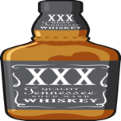

# sour-mash
where iOS test ideas ferment

## Change Log
* Added AWS Device Lab prep script
* Added app icons
* Setup Code Coverage (Coveralls & Slather)
 * Issue: Different Test Coverage when running local vs Travis
   * Local: Test Coverage: 57.69%
    * Travis: Test Coverage: 32.69%
* Setup Travis CI
* Simple Black/White UI with UI Tests
* Created Workspace & Project
